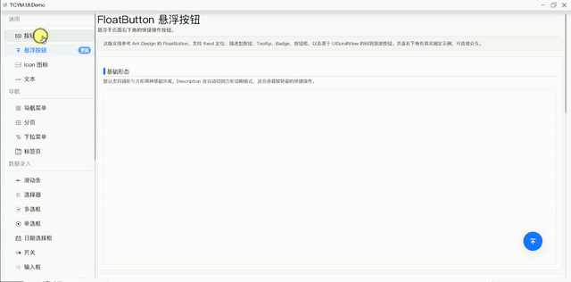

# TCYM.UI.Example

TCYM.UI.Example 是一个可独立构建和运行的 TCYM.UI 示例工程。

这个仓库不再依赖上级源码目录中的 TCYM.UI 和 TCYM.UI.Generator 项目，而是直接引用 Libs 目录中的已编译二进制文件，因此可以单独复制、单独构建、单独发布。

## 文档地址

[https://tcym.top:8035/tcym/UI/Doc/index.html](https://tcym.top:8035/tcym/UI/Doc/index.html)

## 演示视频

点击上方预览图打开演示视频，或下载 [demovideo.mp4](demovideo.mp4) 查看。

## 环境要求

- .NET 8 SDK
- Windows 或 Linux 桌面环境
- 可用的 SDL2 运行环境

## FFmpeg 依赖

示例仓库不内置 FFmpeg 运行库，需要使用相关功能时请按平台自行下载并解压到运行目录或发布目录：

- Linux：[Linux.zip](https://tcym.top:8035/tcym/UI/Linux.zip)
- Windows：[Win.zip](https://tcym.top:8035/tcym/UI/Win.zip)

## 目录说明

- Assets：示例所需图片、字体等资源
- Page：示例页面与组件演示代码
- Libs：独立运行所需的 TCYM.UI、SDL2 等二进制依赖
- Program.cs：示例程序入口

## 构建与运行

在仓库根目录执行：

- dotnet restore
- dotnet build TCYM.UI.Example.csproj
- dotnet run --project TCYM.UI.Example.csproj

## 许可证说明

- 示例源码使用 MIT License，见根目录 LICENSE。
- Libs 目录中的 TCYM.UI 相关二进制文件请按随附许可证使用，见 Libs/LICENSE-TCYM.UI.txt。
