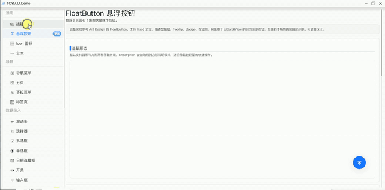

# TCYM.UI.Example

TCYM.UI.Example 是一个可独立构建和运行的 TCYM.UI 示例工程，用于对外展示基础组件、声明式路由、Chart 图表、布局与样式、SDL3 输入事件及跨平台窗口能力。

这个仓库通过 NuGet 引用 `TCYM.UI 0.1.1.21`、`TCYM.UI.Chart 0.1.1.23` 和 `TCYM.UI.Generator 0.1.1.14`，不依赖上级源码目录中的项目，因此可以单独复制、构建和发布。公开仓库不包含 `TCYM.UI.Pro`、Player、PlayerDetection、MvGigECamera 等 Pro 示例源码及其运行依赖。

## 文档地址

[https://tcym.top:8035/tcym/UI/Doc/index.html](https://tcym.top:8035/tcym/UI/Doc/index.html)

## 演示视频

[](demovideo.mp4)

点击上方预览图打开演示视频，或下载 [demovideo.mp4](demovideo.mp4) 查看。

## 环境要求

- 构建需要 .NET 8 SDK，也可使用兼容的更高版本 SDK（如 .NET 10）
- 运行框架依赖版本需要 .NET 8 Runtime；自包含或 Native AOT 发布包无需单独安装 Runtime
- Windows、Linux 或 macOS 桌面环境
- `TCYM.UI` NuGet 包已包含 Windows、Linux 和 macOS 对应的 SDL3 与 SkiaSharp 本地运行库

## 演示内容

- 应用结构：登录演示、同级页面切换、声明式路由、延迟加载、KeepAlive 页面预加载与退出登录
- 基础组件：按钮、锚点、Glass CSS、图标、文本、图片、菜单、分页、标签页、表格、树等
- 数据录入：Input、Checkbox、Radio、Select、TreeSelect、DatePicker、TimePicker、ColorPicker、Slider 等
- 数据展示与反馈：Badge、Carousel、Timeline、Notification、进度条、消息、对话框、水印等
- Chart 图表：折线图、实时/大数据图、柱状图、堆叠/极坐标图、饼图、环形图、玫瑰图和 Gauge 仪表盘等
- SDL3 能力：触控笔事件、文件拖放位置更新、手柄/摇杆输入可视化
- 其他组件：分隔面板、虚拟滚动、文件选择、USB 摄像头等

## 目录说明

- `Assets`：示例所需图片、字体等资源
- `Page/component`：公开基础组件演示代码
- `Page/Charts`：TCYM.UI.Chart 图表示例
- `Page/Layout`：登录、全局路由与主布局代码
- `Libs`：TCYM.UI 相关许可文件
- `publish-aot.bat`：基于 AotAnywhere 的跨平台 Native AOT 发布脚本
- `Program.cs`：示例程序入口

## 构建与运行

在仓库根目录执行：

```bash
dotnet restore
dotnet build TCYM.UI.Example.csproj
dotnet run --project TCYM.UI.Example.csproj
```

## Native AOT 发布

项目使用 `StuDev.AotAnywhere 1.0.4`，可在 Windows 上交叉发布 Windows、Linux 和 macOS 的 x64/arm64 版本：

```bat
publish-aot.bat
```

也可以只发布单个平台：

```bat
publish-aot.bat win-x64
publish-aot.bat linux-arm64
publish-aot.bat osx-arm64
```

## 许可证说明

- 示例源码使用 MIT License，见根目录 LICENSE。
- TCYM.UI 相关包请按随附许可证使用，见 `Libs/LICENSE-TCYM.UI.txt`。